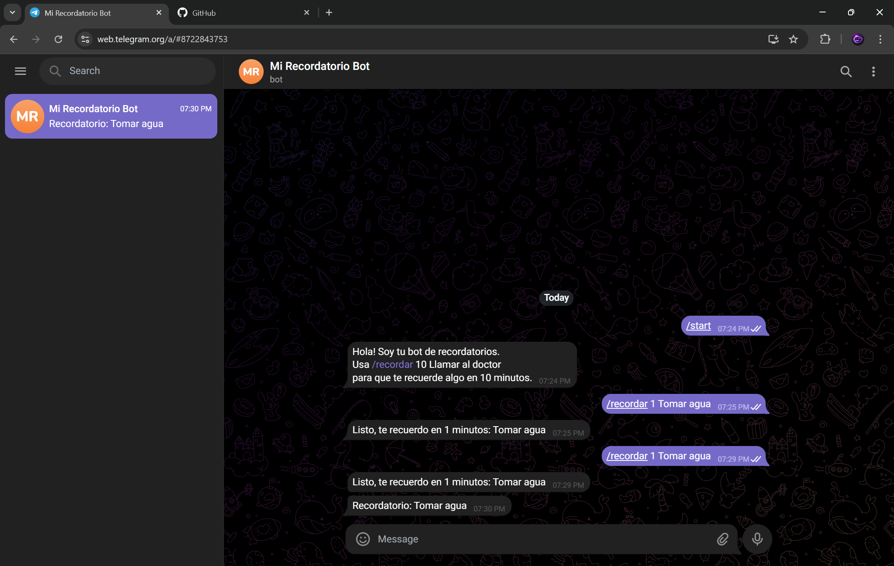

# Bot de Recordatorios en Telegram

Bot que envía recordatorios programados directamente en Telegram.

## Tecnologías
- Python
- python-telegram-bot
- Variables de entorno con dotenv

## Funciones
- /start — inicia el bot
- /recordar 10 Llamar al doctor — te recuerda en 10 minutos

## Cómo usarlo
1. Clona el repositorio
2. Crea un archivo .env con tu token:
   TOKEN=tu_token_aqui
3. Instala las dependencias:
   pip install -r requirements.txt
4. Corre el bot:
   python bot.py

## Demo
@recordatorio_luis_bot en Telegram
